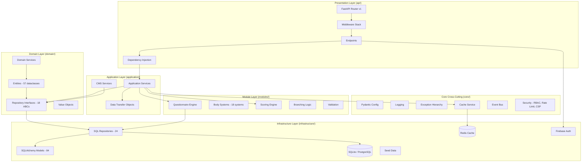
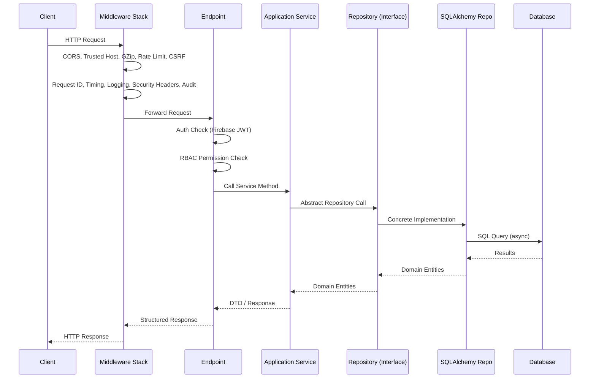
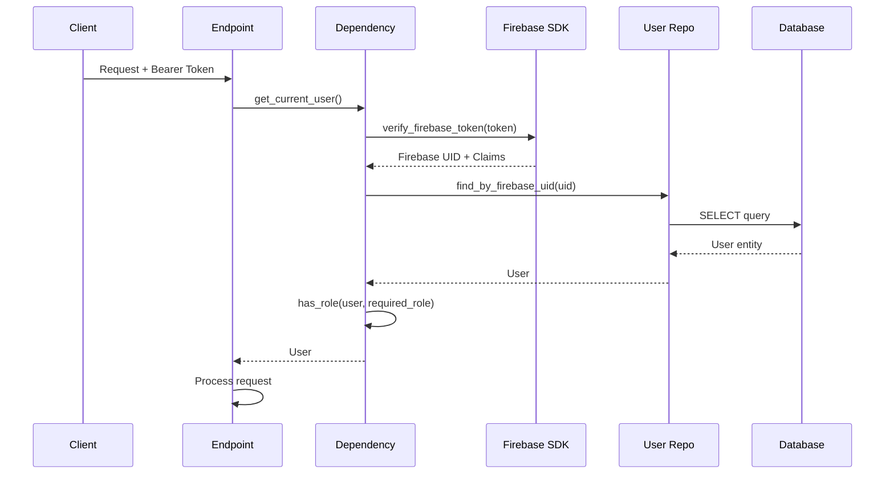

# Medicheck Architecture

## System Overview

Medicheck is a rule-based clinical decision support system (CDSS) built with a **Clean Architecture / Hexagonal** pattern. The system processes patient questionnaire responses through a deterministic clinical reasoning engine to generate health assessments, risk scores, and evidence-based recommendations.

## Architecture Diagram



## Layer Responsibilities

| Layer | Directory | Purpose |
|-------|-----------|---------|
| **Presentation** | `api/` | HTTP endpoints, request parsing, response serialization, middleware stack |
| **Application** | `application/` | Use-case orchestration, service coordination, DTOs, CMS workflows |
| **Domain** | `domain/` | Enterprise business rules: entities, value objects, repository interfaces |
| **Module** | `modules/` | Feature-sliced domain logic: questionnaire engine, body systems, scoring |
| **Infrastructure** | `infrastructure/` | External concerns: database, Redis, Firebase, ORM models, seed data |
| **Core** | `core/` | Cross-cutting: config, logging, exceptions, caching, security, event bus |

## Request Flow



## Middleware Stack (Execution Order)

```
1. CORSMiddleware         - CORS headers
2. TrustedHostMiddleware  - Host header validation
3. GZipMiddleware         - Response compression
4. RequestIDMiddleware    - X-Request-ID propagation
5. RequestTimingMiddleware - X-Response-Time measurement
6. RequestLoggingMiddleware - Structured request/response logging
7. SecurityHeadersMiddleware - CSP, HSTS, X-Frame-Options, etc.
8. AuditLogMiddleware     - Sensitive operation auditing
9. RateLimitMiddleware    - IP-based rate limiting (100 req/60s)
10. CSRFProtectMiddleware - Origin/referer validation (production only)
```

## Authentication Flow



## Authorization (RBAC)

The system defines 9 roles with hierarchical permissions:

| Role | Level | Key Permissions |
|------|-------|----------------|
| Patient | 10 | Answer questionnaires, view own reports |
| Doctor | 20 | Patient CRUD, assessments, reports |
| Specialist | 25 | Doctor + condition/disease management |
| Medical Director | 30 | Specialist + knowledge graph editing |
| Super Admin | 40 | Full system access |
| CMS Medical Editor | 35 | Content management (body systems, indicators, evidence) |
| CMS Publisher | 35 | Publishing workflows, change requests, approvals |
| CMS Approver | 36 | Review and approve content changes |
| CMS Admin | 37 | Full CMS administration + audit logs |

## Key Design Decisions

1. **Rule-based, not ML**: All clinical decisions are deterministic, rule-based with traceable indicator→condition→recommendation links. No black-box AI.

2. **Entity/Model Separation**: Domain entities are plain `@dataclass` objects with business behavior. ORM models are SQLAlchemy `Mapped` classes. Repositories handle the conversion.

3. **Async-first**: Full async/await stack using SQLAlchemy async sessions and aiosqlite/asyncpg.

4. **Repository Pattern**: Domain defines abstract interfaces; infrastructure implements them. Application services depend on abstractions.

5. **Module Slicing**: Domain logic is organized by feature in `modules/` (questionnaire engine, body systems) rather than by technical concern.

6. **Event-driven**: Lightweight in-process domain event bus for decoupled side effects.

7. **Score Normalization**: All scores are normalized to 0–1 range with configurable severity thresholds in the database.
