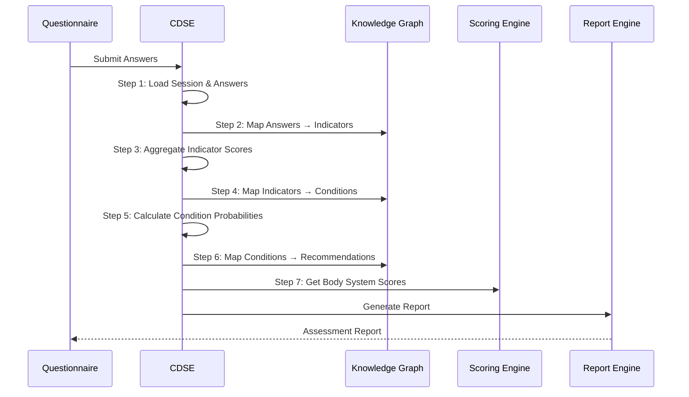

# Clinical Decision Support Engine (CDSE)

## Overview

The CDSE is a rule-based clinical reasoning engine that processes patient questionnaire responses to identify potential conditions and generate evidence-based recommendations.

## Processing Pipeline



### Step-by-Step Processing

#### Step 1: Load Session and Answers

- Load assessment session from database
- Load all answers for the session
- Determine answered vs. skipped questions

#### Step 2: Map Answers to Indicators

For each answer:
- Find linked indicators via `question_indicators` table (question → indicator)
- Find linked indicators via `option_indicators` table (specific option → indicator)
- Collect unique activated indicators

#### Step 3: Aggregate Indicator Scores

For each activated indicator:
- Calculate score from answer values and weights
- Apply `positive_weight`, `negative_weight`, `neutral_weight`
- Normalize confidence score (capped at 1.0)

```python
indicator_score = answer_score * indicator.weight
normalized_confidence = min(indicator.confidence, 1.0)
```

#### Step 4: Map Indicators to Conditions

For each activated indicator:
- Look up linked conditions via `indicator_conditions` table
- Aggregate conditions with their associated indicators

#### Step 5: Calculate Condition Probabilities

For each possible condition:
- Calculate probability based on activated indicators:
  ```
  condition_probability = sum(activated_indicator_scores) / total_possible_score
  ```
- Apply severity classification

#### Step 6: Map Conditions to Recommendations

For each identified condition:
- Look up linked recommendations via `condition_recommendations` table
- Filter by priority and urgency
- Include evidence level from linked evidence

#### Step 7: Generate Explanations

Each recommendation includes a traceable explanation:

```json
{
  "recommendation": "ECG Evaluation",
  "evidence_level": "A",
  "explanation": {
    "trace_id": "cdse-20260723-abc123",
    "triggered_by": [
      {
        "question": "Do you experience chest pain?",
        "answer": "Yes",
        "indicator": "CARDIO_CHEST_PAIN",
        "confidence": 0.85
      }
    ],
    "condition": "Angina Pectoris (ICD-10: I20.9)",
    "evidence": "ESC Guidelines for ACS (European Heart Journal)"
  }
}
```

## Batch Loading

The CDSE uses batch loading to minimize database queries:

```python
# All indicators linked to the session's questions loaded in 1 query
indicators = await indicator_repo.find_by_question_ids(question_ids)

# All conditions linked to activated indicators loaded in 1 query
conditions = await condition_repo.find_by_indicator_ids(indicator_ids)

# All recommendations linked to identified conditions loaded in 1 query
recommendations = await recommendation_repo.find_by_condition_ids(condition_ids)
```

This reduces N+1 queries to 7 total queries regardless of session size.

## Scoring

### Body System Scoring

Scores are calculated per body system:

```
system_score = earned / max_possible
```

Where:
- `earned` = sum of score values for answered questions in the system
- `max_possible` = sum of all question weights in the system

### Severity Classification

```python
def classify_severity(score: float) -> str:
    if score >= thresholds.critical: return "critical"
    if score >= thresholds.high: return "high"
    if score >= thresholds.moderate: return "moderate"
    return "low"
```

## CDSE Output

```json
{
  "summary": {
    "activated_indicators": 5,
    "activated_conditions": 3,
    "total_recommendations": 7,
    "severity": "moderate",
    "confidence": 0.78,
    "scores": {
      "cardiovascular": 0.85,
      "respiratory": 0.30
    }
  },
  "indicators": [...],
  "conditions": [...],
  "recommendations": [
    {
      "id": "...",
      "title": "ECG Evaluation",
      "priority": 9,
      "urgency": "urgent",
      "evidence_level": "A",
      "trace_id": "cdse-20260723-abc123"
    }
  ]
}
```

## Key Design Principles

1. **Deterministic**: Same inputs always produce same outputs (no randomization)
2. **Traceable**: Every recommendation links back to specific questions and evidence
3. **Rule-based**: No machine learning — all logic is explicit and auditable
4. **Efficient**: Batch loading limits database queries to O(number of node types)
5. **Extensible**: New indicators, conditions, and recommendations can be added via CMS without code changes

## Key Files

- `backend/app/application/services/clinical_decision_service.py` — Main CDSE implementation
- `backend/app/modules/questionnaire/scoring.py` — Score calculation
- `backend/app/domain/entities/clinical_indicator.py` — Indicator entity
- `backend/app/domain/entities/possible_condition.py` — Condition entity
- `backend/app/domain/entities/recommendation.py` — Recommendation entity
