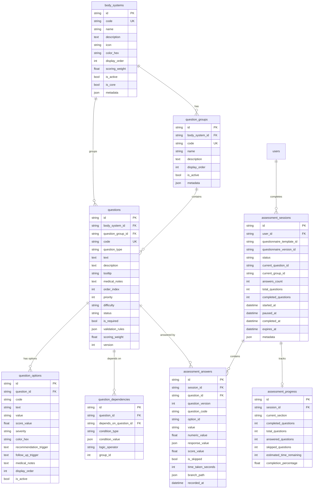
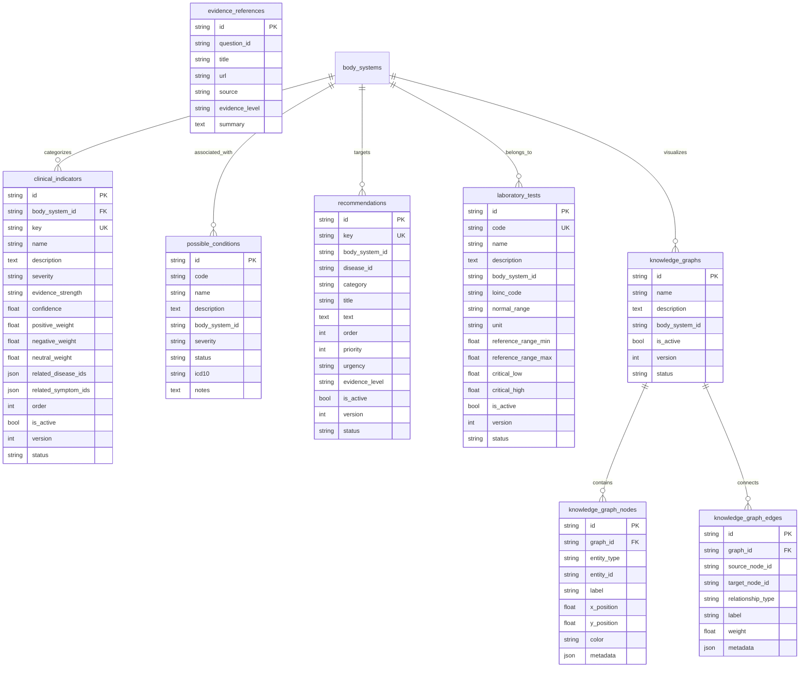
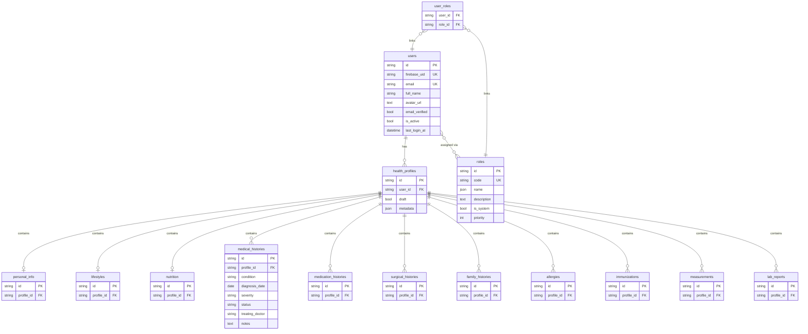
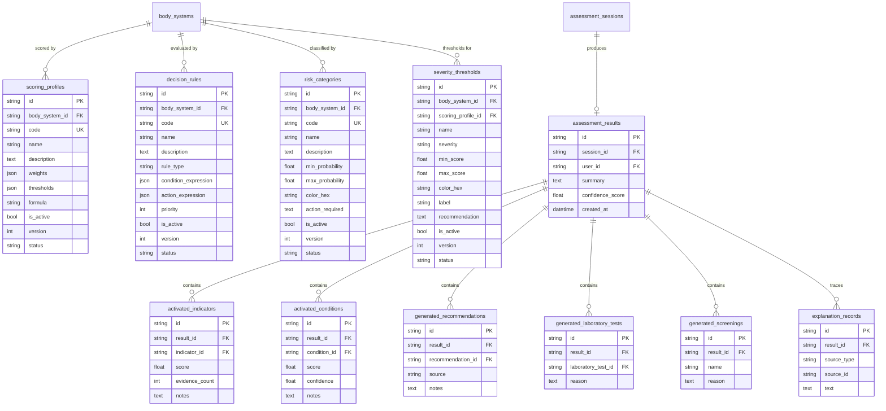
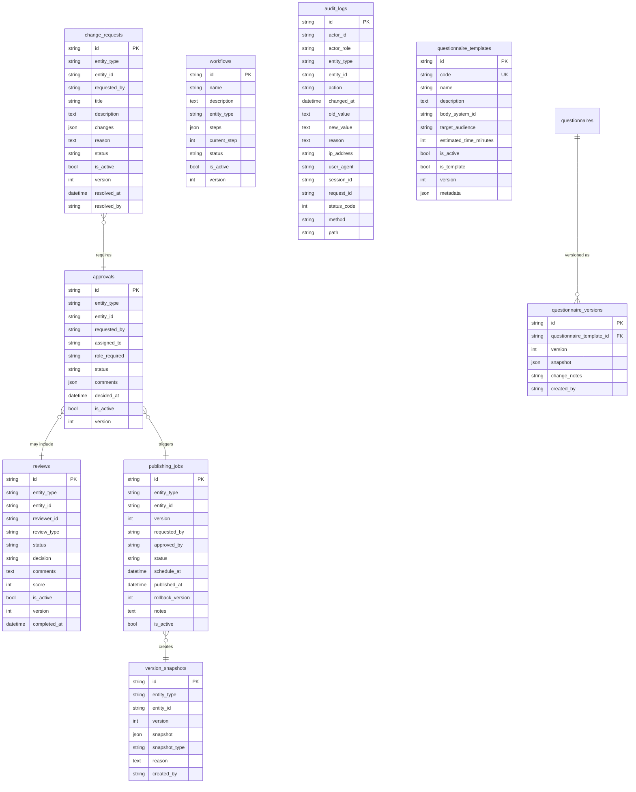

# Entity-Relationship Diagrams — Medicheck

> All entities use UUID primary keys (`id: String(32)`) and inherit `created_at`, `updated_at`, `deleted_at` timestamps from `BaseModel`. Soft-delete is used throughout.

---

## 1. Core Clinical Entities

---

## 2. Knowledge Graph Entities

---

## 3. Link Tables (Many-to-Many Relationships)

```mermaid
erDiagram
    question_indicator_links {
        string id PK
        string question_id FK
        string indicator_id FK
        bool active
    }

    question_option_indicator_links {
        string id PK
        string question_option_id FK
        string indicator_id FK
        bool active
    }

    indicator_condition_links {
        string id PK
        string indicator_id FK
        string condition_id FK
        bool active
    }

    indicator_evidence_links {
        string id PK
        string indicator_id FK
        string evidence_id FK
        bool active
    }

    indicator_recommendation_links {
        string id PK
        string indicator_id FK
        string recommendation_id FK
        bool active
    }

    condition_recommendation_links {
        string id PK
        string condition_id FK
        string recommendation_id FK
        bool active
    }

    condition_laboratory_test_links {
        string id PK
        string condition_id FK
        string laboratory_test_id FK
        bool active
    }

    body_system_condition_links {
        string id PK
        string body_system_id FK
        string condition_id FK
        bool active
    }

    questions }o--|| question_indicator_links : "links to"
    clinical_indicators }o--|| question_indicator_links : "linked from"
    questions }o--|| question_option_indicator_links : "via option"
    question_options }o--|| question_option_indicator_links : "links indicator"
    clinical_indicators }o--|| question_option_indicator_links : "linked from option"
    clinical_indicators }o--|| indicator_condition_links : "maps to"
    possible_conditions }o--|| indicator_condition_links : "mapped from"
    clinical_indicators }o--|| indicator_evidence_links : "supported by"
    evidence_references }o--|| indicator_evidence_links : "supports"
    clinical_indicators }o--|| indicator_recommendation_links : "suggests"
    recommendations }o--|| indicator_recommendation_links : "suggested for"
    possible_conditions }o--|| condition_recommendation_links : "triggers"
    recommendations }o--|| condition_recommendation_links : "triggered by"
    possible_conditions }o--|| condition_laboratory_test_links : "requires"
    laboratory_tests }o--|| condition_laboratory_test_links : "required for"
    body_systems }o--|| body_system_condition_links : "related to"
    possible_conditions }o--|| body_system_condition_links : "related from"
```

---

## 4. User / Profile Entities

---

## 5. Scoring & Decision Entities

---

## 6. CMS / Admin Entities

