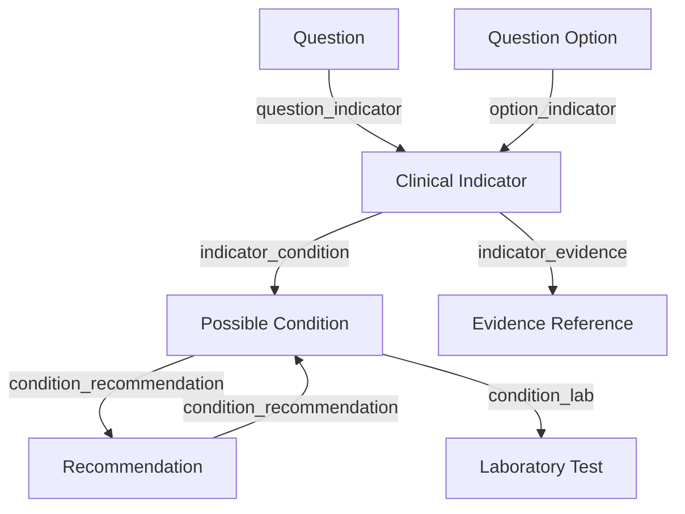

# Knowledge Graph Documentation

## Overview

The Knowledge Graph is the central ontology linking all clinical concepts. It enables traceable, rule-based clinical decision support.

## Graph Structure



## Node Types

### Clinical Indicator

Detectable clinical sign from questionnaire responses.

```json
{
  "id": "32-char-hex",
  "key": "CARDIO_CHEST_PAIN",
  "name": "Chest Pain",
  "body_system_id": "CARDIO",
  "severity": "moderate",
  "evidence_strength": "B",
  "confidence": 0.78,
  "positive_weight": 1.0,
  "negative_weight": 0.0,
  "neutral_weight": 0.0
}
```

### Possible Condition

A medical condition that may be indicated.

```json
{
  "id": "32-char-hex",
  "code": "I20",
  "name": "Angina Pectoris",
  "icd10_code": "I20.9",
  "body_system_id": "CARDIO",
  "severity": "high",
  "typical": true
}
```

### Recommendation

Clinical recommendation for a condition.

```json
{
  "id": "32-char-hex",
  "key": "CARDIO_ECG_REC",
  "body_system_id": "CARDIO",
  "category": "diagnostic",
  "title": "ECG Evaluation",
  "text": "Perform 12-lead ECG to evaluate for cardiac ischemia",
  "priority": 9,
  "urgency": "urgent",
  "evidence_level": "A"
}
```

### Laboratory Test

Diagnostic test for a condition.

```json
{
  "id": "32-char-hex",
  "code": "TROP_I",
  "name": "Troponin I",
  "loinc_code": "10839-0",
  "body_system_id": "CARDIO",
  "reference_range_low": 0.0,
  "reference_range_high": 0.04,
  "unit": "ng/mL"
}
```

### Evidence Reference

Medical evidence supporting an indicator.

```json
{
  "id": "32-char-hex",
  "title": "ESC Guidelines for Management of Acute Coronary Syndromes",
  "source": "European Heart Journal",
  "source_type": "guideline",
  "evidence_level": "A",
  "url": "https://doi.org/10.1093/eurheartj/ehab425"
}
```

## Link Tables

| Link Table | Source | Target | Description |
|-----------|--------|--------|-------------|
| `question_indicators` | Question | Indicator | Maps questions to clinical indicators |
| `option_indicators` | QuestionOption | Indicator | Maps specific answer options to indicators |
| `indicator_conditions` | Indicator | Condition | Maps indicators to possible conditions |
| `condition_recommendations` | Condition | Recommendation | Maps conditions to recommendations |
| `condition_laboratory_tests` | Condition | Lab Test | Maps conditions to diagnostic tests |
| `indicator_evidences` | Indicator | Evidence | Maps indicators to evidence references |

## Traversal Examples

### Question → Recommendation Chain

```
Question "Do you experience chest pain?"
  → Option "Yes" (score: 1.0)
    → Indicator "CARDIO_CHEST_PAIN" (confidence: 0.85)
      → Condition "Angina Pectoris" (ICD-10: I20.9)
      → Condition "Myocardial Infarction" (ICD-10: I21)
        → Recommendation "ECG Evaluation" (priority: 9, evidence: A)
        → Recommendation "Cardiology Referral" (priority: 8, evidence: B)
        → Lab Test "Troponin I" (LOINC: 10839-0)
```

### Indicator → Evidence Chain

```
Indicator "CARDIO_CHEST_PAIN"
  → Evidence "ESC Guidelines for ACS" (level: A, journal)
  → Evidence "Framingham Risk Score Study" (level: B, clinical_trial)
```

## CRUD Operations

### Create Node

```http
POST /api/v1/cms/knowledge-graph/indicators
Content-Type: application/json
Authorization: Bearer <token>

{
  "body_system_id": "CARDIO",
  "key": "CARDIO_CHEST_PAIN",
  "name": "Chest Pain",
  "severity": "moderate"
}
```

### Create Link

```http
POST /api/v1/cms/knowledge-graph/link-indicator-condition
Content-Type: application/json
Authorization: Bearer <token>

{
  "indicator_id": "<id>",
  "condition_id": "<id>"
}
```

## Validation Rules

- **No orphan indicators**: Every indicator must link to ≥1 condition and ≥1 question/option
- **No orphan conditions**: Every condition must link to ≥1 indicator and ≥1 recommendation
- **No orphan recommendations**: Every recommendation must link to ≥1 condition
- **Unique keys**: Indicator keys, condition codes, recommendation keys must be unique
- **LOINC/ICD-10 format**: Lab tests should use valid LOINC codes; conditions should use valid ICD-10 codes
