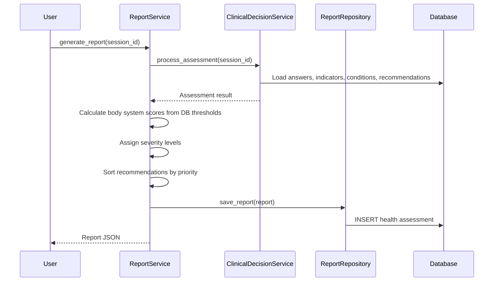

# Report Engine Documentation

## Overview

The Report Engine generates structured health assessment reports from CDSE processing results. Reports include severity summaries, body system scores, recommendations, and optional report comparison.

## Report Structure

```json
{
  "report_id": "rpt_abc123",
  "session_id": "ses_def456",
  "user_id": "usr_ghi789",
  "generated_at": "2026-07-23T10:30:00Z",
  "summary": {
    "severity": "moderate",
    "overall_score": 0.65,
    "activated_indicators": 5,
    "possible_conditions": 3,
    "total_recommendations": 7,
    "confidence": 0.78
  },
  "body_system_scores": {
    "cardiovascular": { "score": 0.85, "max": 1.0, "percentage": 85.0, "severity": "high" },
    "respiratory": { "score": 0.30, "max": 1.0, "percentage": 30.0, "severity": "low" }
  },
  "activated_indicators": [...],
  "possible_conditions": [...],
  "recommendations": [
    {
      "priority": 9,
      "urgency": "urgent",
      "evidence_level": "A",
      "title": "ECG Evaluation",
      "text": "Perform 12-lead ECG to evaluate for cardiac ischemia",
      "trace_id": "cdse-20260723-abc123"
    }
  ],
  "generated_recommendations": [...],
  "metadata": {
    "total_questions": 25,
    "answered": 22,
    "skipped": 3,
    "completion_rate": 0.88
  }
}
```

## Report Generation Flow



## Report Comparison

Reports can be compared to track changes over time:

```http
GET /api/v1/reports/compare?report_id_1=rpt_abc&report_id_2=rpt_def
```

### Comparison Output

```json
{
  "report_1": { "generated_at": "...", "severity": "moderate", "score": 0.65 },
  "report_2": { "generated_at": "...", "severity": "low", "score": 0.35 },
  "changes": {
    "severity": "improved (moderate → low)",
    "score_delta": -0.30,
    "indicators_resolved": ["CARDIO_CHEST_PAIN"],
    "indicators_new": [],
    "conditions_resolved": ["Angina Pectoris"],
    "conditions_new": []
  }
}
```

## Scoring Thresholds

Thresholds are loaded from the `severity_thresholds` database table on each report generation:

| Threshold Key | Default Value | Description |
|--------------|--------------|-------------|
| `low_max` | 0.30 | Maximum score for low severity |
| `moderate_max` | 0.60 | Maximum score for moderate severity |
| `high_max` | 0.85 | Maximum score for high severity |
| `critical_min` | 0.85 | Minimum score for critical severity |

## API Endpoints

```http
GET    /api/v1/reports/{report_id}         # Get report by ID
POST   /api/v1/reports/generate            # Generate new report (triggers CDSE)
GET    /api/v1/reports/compare             # Compare two reports
GET    /api/v1/reports/user/{user_id}      # List reports for a user
```

## Caching

Reports are cached in Redis for 300 seconds (configurable):

```python
cache_key = f"report:{report_id}"
cached = await cache.get(cache_key)
if cached:
    return cached

report = await generate_report(session_id)
await cache.set(cache_key, report, ttl=300)
return report
```

## Key Files

- `backend/app/application/services/report_service.py` — Report generation and comparison
- `backend/app/infrastructure/persistence/repositories/sql_report_repository.py` — Report persistence
- `backend/app/infrastructure/persistence/models/health_assessment.py` — Report ORM model
