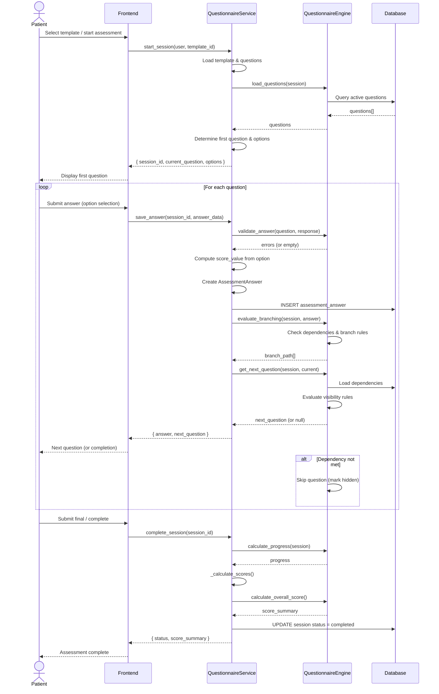
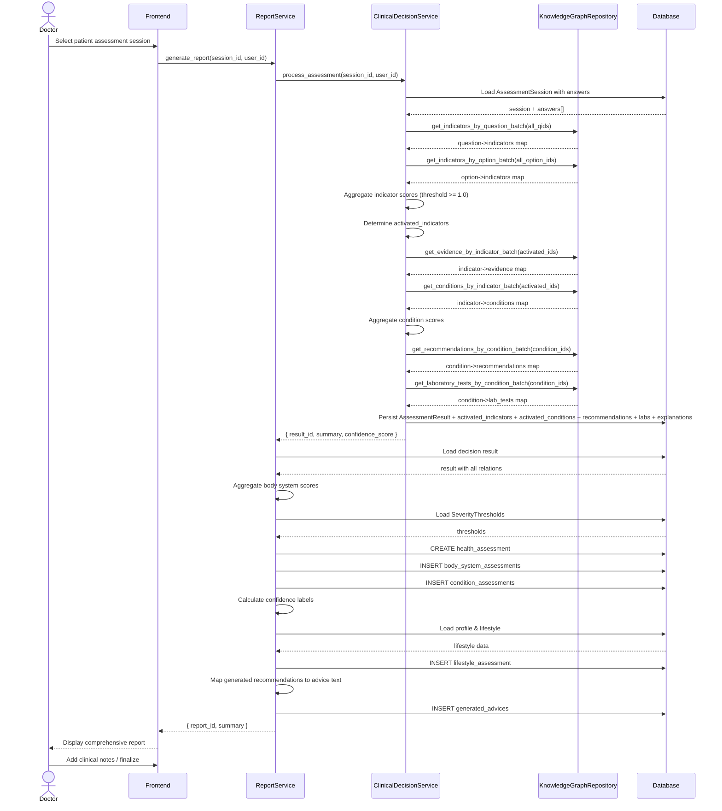
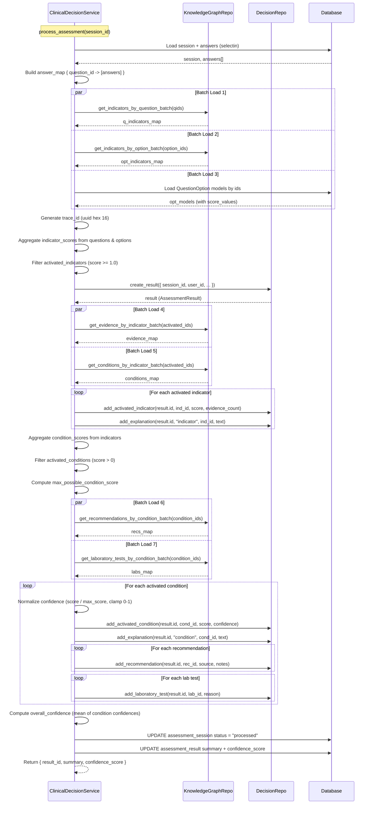
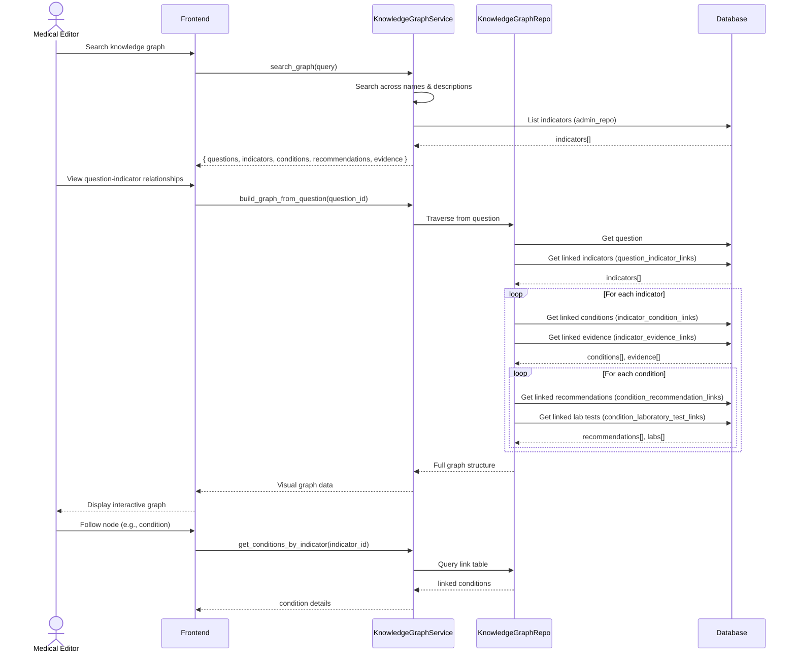
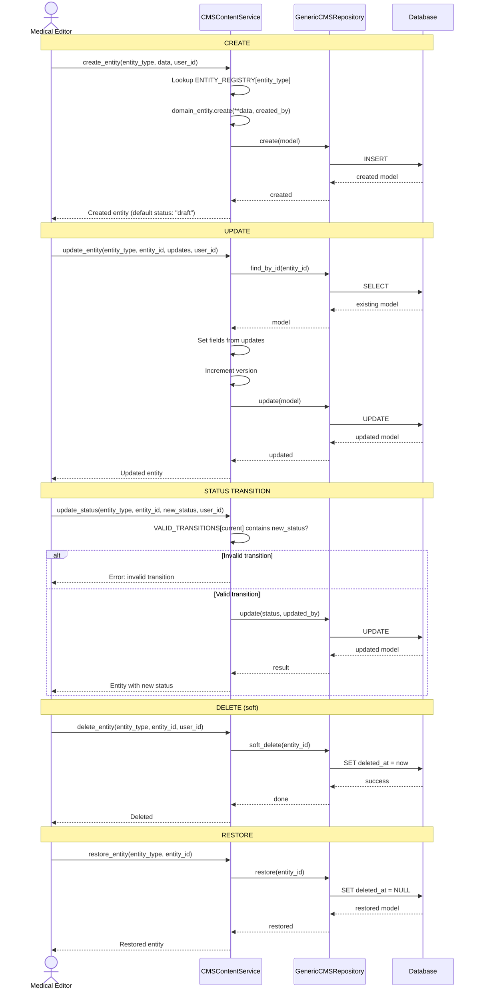
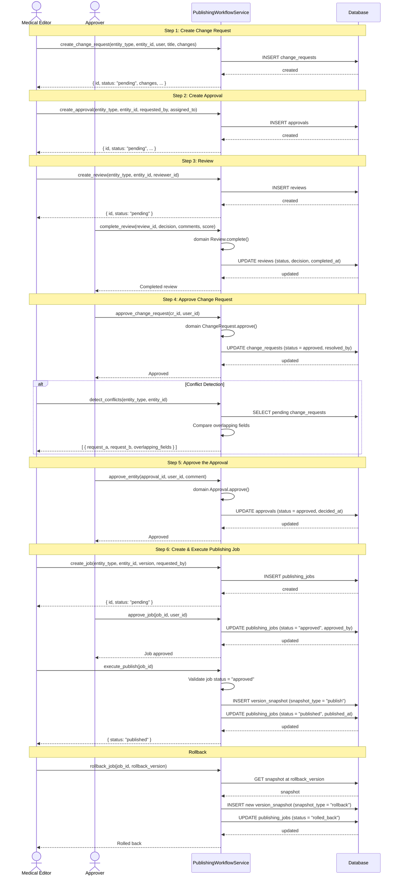
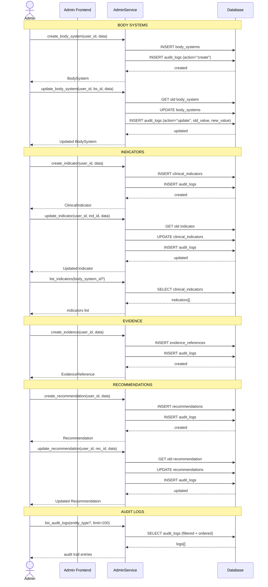
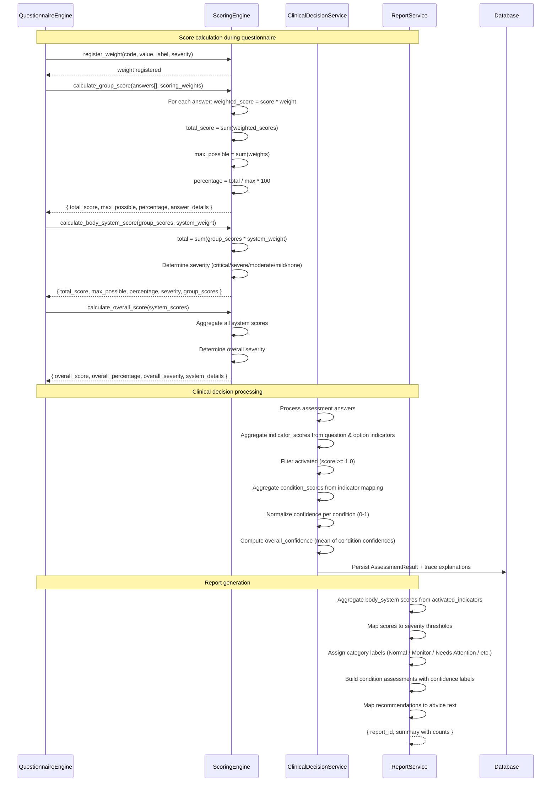

# Sequence Diagrams — Medicheck

---

## 1. Patient Completes Questionnaire

---

## 2. Doctor Reviews Assessment & Generates Report

---

## 3. Clinical Decision Support Engine (CDSE) Processing Pipeline

---

## 4. Knowledge Graph Search & Navigation

---

## 5. CMS Content Lifecycle (Create → Update → Publish)

---

## 6. Publishing Workflow (Change Request → Approval → Snapshot)

---

## 7. Admin CRUD Operations

---

## 8. Full Scoring & Recommendation Pipeline

