# Core Engines & Data Architecture

*This document covers Deliverables 9-16: Database Architecture, Entity Relationship Diagram, API Architecture (detailed), Authentication Architecture, Authorization Architecture, Questionnaire Engine, Risk Engine, AI Architecture.*

---

# 9. Database Architecture (Detailed)

## 9.1 Design Principles

| Principle | Application |
|---|---|
| **Normalization** | 3NF with selective denormalization for read-heavy dashboard aggregates |
| **UUID Primary Keys** | Distributed-friendly, no sequential ID leaks, safe for client-side generation |
| **JSONB for Flexibility** | Multi-language question text, extensible metadata, dynamic rule conditions |
| **Soft Deletes** | All PHI tables use `deleted_at` — never permanently deleted |
| **Immutable Audit** | Append-only audit_logs with SHA-256 chain for integrity verification |
| **Temporal Tracking** | Content versioning via snapshot tables (questions, risk rules) |
| **Composite Indexes** | Covering indexes for all query patterns (user_id + timestamp) |
| **Partial Indexes** | `WHERE is_active = true` for active-only queries |
| **Partitioning Ready** | Large tables designed for future partitioning by time or hash |

## 9.2 Schema: Core Identity

```sql
-- Users (synced from Firebase Auth)
CREATE TABLE users (
    id                  UUID PRIMARY KEY DEFAULT gen_random_uuid(),
    firebase_uid        VARCHAR(128) NOT NULL UNIQUE,
    email               VARCHAR(255) NOT NULL,
    full_name           VARCHAR(255),
    avatar_url          TEXT,
    email_verified      BOOLEAN DEFAULT FALSE,
    is_active           BOOLEAN DEFAULT TRUE,
    last_login_at       TIMESTAMPTZ,
    metadata            JSONB DEFAULT '{}',
    created_at          TIMESTAMPTZ DEFAULT NOW(),
    updated_at          TIMESTAMPTZ DEFAULT NOW(),
    deleted_at          TIMESTAMPTZ
);

CREATE INDEX idx_users_firebase ON users(firebase_uid);
CREATE INDEX idx_users_email ON users(email) WHERE deleted_at IS NULL;

-- Roles (system-defined + custom)
CREATE TABLE roles (
    id                  UUID PRIMARY KEY DEFAULT gen_random_uuid(),
    code                VARCHAR(50) NOT NULL UNIQUE,   -- 'patient','doctor','researcher','admin'
    name                JSONB NOT NULL,                 -- multi-language
    description         JSONB,
    is_system           BOOLEAN DEFAULT FALSE,          -- cannot delete system roles
    priority            INT DEFAULT 0,                  -- higher = more privileges
    created_at          TIMESTAMPTZ DEFAULT NOW()
);

-- Permissions (granular action-based)
CREATE TABLE permissions (
    id                  UUID PRIMARY KEY DEFAULT gen_random_uuid(),
    code                VARCHAR(100) NOT NULL UNIQUE,
    name                VARCHAR(255),
    resource            VARCHAR(50),     -- 'questionnaire','user','assessment'
    action              VARCHAR(50),     -- 'create','read','update','delete'
    description         TEXT,
    created_at          TIMESTAMPTZ DEFAULT NOW()
);

-- Role ↔ Permission mapping
CREATE TABLE role_permissions (
    role_id             UUID REFERENCES roles(id) ON DELETE CASCADE,
    permission_id       UUID REFERENCES permissions(id) ON DELETE CASCADE,
    created_at          TIMESTAMPTZ DEFAULT NOW(),
    PRIMARY KEY (role_id, permission_id)
);

-- User ↔ Role mapping (supporting multiple roles)
CREATE TABLE user_roles (
    user_id             UUID REFERENCES users(id) ON DELETE CASCADE,
    role_id             UUID REFERENCES roles(id) ON DELETE CASCADE,
    assigned_by         UUID REFERENCES users(id),
    created_at          TIMESTAMPTZ DEFAULT NOW(),
    PRIMARY KEY (user_id, role_id)
);

-- Active sessions tracking
CREATE TABLE user_sessions (
    id                  UUID PRIMARY KEY DEFAULT gen_random_uuid(),
    user_id             UUID REFERENCES users(id) ON DELETE CASCADE,
    firebase_refresh_token VARCHAR(255),
    ip_address          INET,
    user_agent          TEXT,
    device_info         JSONB,
    is_active           BOOLEAN DEFAULT TRUE,
    last_activity_at    TIMESTAMPTZ,
    expires_at          TIMESTAMPTZ,
    created_at          TIMESTAMPTZ DEFAULT NOW()
);

CREATE INDEX idx_sessions_user_active ON user_sessions(user_id, is_active) WHERE is_active;
```

## 9.3 Schema: Health Profiles

```sql
-- Extended health profile (1:1 with users)
CREATE TABLE user_profiles (
    id                  UUID PRIMARY KEY DEFAULT gen_random_uuid(),
    user_id             UUID UNIQUE REFERENCES users(id) ON DELETE CASCADE,
    date_of_birth       DATE,
    gender              VARCHAR(20),
    blood_group         VARCHAR(5),
    height_cm           DECIMAL(5,1),
    weight_kg           DECIMAL(5,1),
    bmi                 DECIMAL(4,1) GENERATED ALWAYS AS (
        CASE WHEN height_cm > 0 THEN weight_kg / ((height_cm/100)^2) ELSE NULL END
    ) STORED,
    occupation          VARCHAR(255),
    transport_method    VARCHAR(100),
    exercise_frequency  VARCHAR(50),
    diet_type           VARCHAR(50),
    sleep_hours         DECIMAL(3,1),
    alcohol_consumption VARCHAR(50),
    smoking_status      VARCHAR(50),
    substance_use       JSONB,
    metadata            JSONB DEFAULT '{}',
    created_at          TIMESTAMPTZ DEFAULT NOW(),
    updated_at          TIMESTAMPTZ DEFAULT NOW()
);

-- Family medical history
CREATE TABLE user_family_history (
    id                  UUID PRIMARY KEY DEFAULT gen_random_uuid(),
    user_id             UUID REFERENCES users(id) ON DELETE CASCADE,
    relationship        VARCHAR(50) NOT NULL,  -- 'mother','father','sibling','grandparent','child'
    condition_code      VARCHAR(100),
    condition_name      VARCHAR(255) NOT NULL,
    age_at_diagnosis    INT,
    is_deceased         BOOLEAN,
    notes               TEXT,
    created_at          TIMESTAMPTZ DEFAULT NOW(),
    updated_at          TIMESTAMPTZ DEFAULT NOW()
);

CREATE INDEX idx_family_user ON user_family_history(user_id);

-- Medical history (conditions, surgeries, allergies)
CREATE TABLE user_medical_history (
    id                  UUID PRIMARY KEY DEFAULT gen_random_uuid(),
    user_id             UUID REFERENCES users(id) ON DELETE CASCADE,
    category            VARCHAR(50) NOT NULL CHECK (category IN (
        'condition','surgery','allergy','immunization','injury','other'
    )),
    code                VARCHAR(100),
    name                VARCHAR(255) NOT NULL,
    onset_date          DATE,
    resolution_date     DATE,
    is_active           BOOLEAN DEFAULT TRUE,
    severity            VARCHAR(20),  -- 'mild','moderate','severe'
    notes               TEXT,
    metadata            JSONB DEFAULT '{}',
    created_at          TIMESTAMPTZ DEFAULT NOW(),
    updated_at          TIMESTAMPTZ DEFAULT NOW()
);

CREATE INDEX idx_medhist_user ON user_medical_history(user_id);
CREATE INDEX idx_medhist_category ON user_medical_history(user_id, category) WHERE is_active;

-- Medications
CREATE TABLE user_medications (
    id                  UUID PRIMARY KEY DEFAULT gen_random_uuid(),
    user_id             UUID REFERENCES users(id) ON DELETE CASCADE,
    medication_name     VARCHAR(255) NOT NULL,
    dosage              VARCHAR(100),
    frequency           VARCHAR(100),  -- 'once_daily','twice_daily','as_needed'
    route               VARCHAR(50),   -- 'oral','topical','injection'
    prescribed_by       VARCHAR(255),
    start_date          DATE,
    end_date            DATE,
    is_active           BOOLEAN DEFAULT TRUE,
    notes               TEXT,
    created_at          TIMESTAMPTZ DEFAULT NOW(),
    updated_at          TIMESTAMPTZ DEFAULT NOW()
);

CREATE INDEX idx_meds_user_active ON user_medications(user_id, is_active) WHERE is_active;
```

## 9.4 Schema: Questionnaire Engine

```sql
-- Body systems (pluggable modules)
CREATE TABLE body_systems (
    id                  UUID PRIMARY KEY DEFAULT gen_random_uuid(),
    code                VARCHAR(50) NOT NULL UNIQUE,
    name                JSONB NOT NULL,
    description         JSONB,
    icon                VARCHAR(100),
    color_hex           VARCHAR(7),
    display_order       INT,
    module_version      VARCHAR(20) DEFAULT '1.0.0',
    is_active           BOOLEAN DEFAULT TRUE,
    is_core             BOOLEAN DEFAULT FALSE,
    scoring_weight      DECIMAL(3,2) DEFAULT 0.05,  -- contribution to overall score
    metadata            JSONB DEFAULT '{}',
    created_at          TIMESTAMPTZ DEFAULT NOW(),
    updated_at          TIMESTAMPTZ DEFAULT NOW()
);

-- Question categories
CREATE TABLE question_categories (
    id                  UUID PRIMARY KEY DEFAULT gen_random_uuid(),
    code                VARCHAR(50) NOT NULL,
    name                JSONB NOT NULL,
    description         JSONB,
    body_system_id      UUID REFERENCES body_systems(id),
    display_order       INT,
    is_active           BOOLEAN DEFAULT TRUE,
    created_at          TIMESTAMPTZ DEFAULT NOW(),
    UNIQUE(code, body_system_id)
);

-- Questions (the heart of the system)
CREATE TABLE questions (
    id                  UUID PRIMARY KEY DEFAULT gen_random_uuid(),
    code                VARCHAR(100) NOT NULL UNIQUE,
    body_system_id      UUID REFERENCES body_systems(id),
    category_id         UUID REFERENCES question_categories(id),
    question_type       VARCHAR(30) NOT NULL CHECK (question_type IN (
        'single_choice','multiple_choice','scale','boolean',
        'text','numeric','date','blood_pressure',
        'height_weight','multiline','file'
    )),
    text                JSONB NOT NULL,            -- multi-language
    description         JSONB,                     -- hint/context (multi-lang)
    placeholder         JSONB,                     -- placeholder text (multi-lang)
    order_index         INT NOT NULL,
    priority            INT DEFAULT 3 CHECK (priority BETWEEN 1 AND 5),
    difficulty          VARCHAR(20) DEFAULT 'basic' CHECK (difficulty IN ('basic','intermediate','advanced')),
    is_active           BOOLEAN DEFAULT TRUE,
    is_required         BOOLEAN DEFAULT TRUE,
    validation_rules    JSONB,                     -- {min, max, regex, min_length, ...}
    scoring_weight      DECIMAL(3,2) DEFAULT 1.0,
    evidence_ref        TEXT,                      -- link to medical literature
    medical_notes       JSONB,                     -- doctor-only notes
    metadata            JSONB DEFAULT '{}',
    version             INT DEFAULT 1,
    created_at          TIMESTAMPTZ DEFAULT NOW(),
    updated_at          TIMESTAMPTZ DEFAULT NOW(),
    deprecated_at       TIMESTAMPTZ
);

CREATE INDEX idx_questions_active ON questions(body_system_id) WHERE is_active;
CREATE INDEX idx_questions_category ON questions(category_id) WHERE is_active;
CREATE INDEX idx_questions_order ON questions(body_system_id, order_index);
CREATE INDEX idx_questions_code ON questions(code);

-- Question choices (for choice-based types)
CREATE TABLE question_choices (
    id                  UUID PRIMARY KEY DEFAULT gen_random_uuid(),
    question_id         UUID REFERENCES questions(id) ON DELETE CASCADE,
    code                VARCHAR(100) NOT NULL,
    text                JSONB NOT NULL,            -- multi-language
    description         JSONB,
    order_index         INT NOT NULL,
    score_value         DECIMAL(5,2) DEFAULT 0,    -- risk contribution weight
    is_active           BOOLEAN DEFAULT TRUE,
    metadata            JSONB DEFAULT '{}',
    created_at          TIMESTAMPTZ DEFAULT NOW(),
    UNIQUE(question_id, code)
);

CREATE INDEX idx_choices_question ON question_choices(question_id, order_index);

-- Question dependencies (branching logic)
CREATE TABLE question_dependencies (
    id                  UUID PRIMARY KEY DEFAULT gen_random_uuid(),
    question_id         UUID REFERENCES questions(id) ON DELETE CASCADE,
    depends_on_question_id UUID REFERENCES questions(id) ON DELETE CASCADE,
    condition_type      VARCHAR(30) NOT NULL CHECK (condition_type IN (
        'equals','not_equals','in','not_in',
        'greater_than','less_than','gte','lte',
        'range','has_any','has_all','is_empty','is_not_empty'
    )),
    condition_value     JSONB NOT NULL,
    logic_operator      VARCHAR(5) DEFAULT 'AND' CHECK (logic_operator IN ('AND','OR')),
    group_id            INT DEFAULT 0,
    created_at          TIMESTAMPTZ DEFAULT NOW(),
    CONSTRAINT different_questions CHECK (question_id != depends_on_question_id)
);

CREATE INDEX idx_deps_question ON question_dependencies(question_id);
CREATE INDEX idx_deps_depends ON question_dependencies(depends_on_question_id);

-- Question version history
CREATE TABLE question_versions (
    id                  UUID PRIMARY KEY DEFAULT gen_random_uuid(),
    question_id         UUID REFERENCES questions(id) ON DELETE CASCADE,
    version             INT NOT NULL,
    snapshot            JSONB NOT NULL,            -- full question state at this version
    change_notes        TEXT,
    changed_by          UUID REFERENCES users(id),
    created_at          TIMESTAMPTZ DEFAULT NOW(),
    UNIQUE(question_id, version)
);

-- Questionnaires (collections of questions)
CREATE TABLE questionnaires (
    id                  UUID PRIMARY KEY DEFAULT gen_random_uuid(),
    code                VARCHAR(100) NOT NULL UNIQUE,
    name                JSONB NOT NULL,
    description         JSONB,
    body_system_id      UUID REFERENCES body_systems(id),
    version             INT DEFAULT 1,
    is_template         BOOLEAN DEFAULT FALSE,
    estimated_time_minutes INT,
    target_audience     VARCHAR(50) DEFAULT 'all' CHECK (target_audience IN (
        'all','male','female','age_18_30','age_31_50','age_50_plus','age_65_plus'
    )),
    is_active           BOOLEAN DEFAULT TRUE,
    metadata            JSONB DEFAULT '{}',
    created_at          TIMESTAMPTZ DEFAULT NOW(),
    updated_at          TIMESTAMPTZ DEFAULT NOW()
);

-- Sections within questionnaires
CREATE TABLE sections (
    id                  UUID PRIMARY KEY DEFAULT gen_random_uuid(),
    questionnaire_id    UUID REFERENCES questionnaires(id) ON DELETE CASCADE,
    code                VARCHAR(100),
    title               JSONB NOT NULL,
    description         JSONB,
    order_index         INT NOT NULL,
    metadata            JSONB DEFAULT '{}',
    created_at          TIMESTAMPTZ DEFAULT NOW()
);

CREATE INDEX idx_sections_q ON sections(questionnaire_id, order_index);

-- Questionnaire ↔ Question (many-to-many)
CREATE TABLE questionnaire_questions (
    id                  UUID PRIMARY KEY DEFAULT gen_random_uuid(),
    questionnaire_id    UUID REFERENCES questionnaires(id) ON DELETE CASCADE,
    question_id         UUID REFERENCES questions(id) ON DELETE CASCADE,
    section_id          UUID REFERENCES sections(id),
    order_index         INT NOT NULL,
    is_optional         BOOLEAN DEFAULT FALSE,
    UNIQUE(questionnaire_id, question_id)
);

CREATE INDEX idx_qq_order ON questionnaire_questions(questionnaire_id, order_index);

-- Questionnaire sessions (user taking a questionnaire)
CREATE TABLE questionnaire_sessions (
    id                  UUID PRIMARY KEY DEFAULT gen_random_uuid(),
    user_id             UUID REFERENCES users(id) ON DELETE CASCADE,
    questionnaire_id    UUID REFERENCES questionnaires(id),
    status              VARCHAR(20) DEFAULT 'draft' CHECK (status IN (
        'draft','active','paused','completed','expired','abandoned'
    )),
    current_question_id UUID REFERENCES questions(id),
    answers_count       INT DEFAULT 0,
    total_questions     INT,
    started_at          TIMESTAMPTZ DEFAULT NOW(),
    completed_at        TIMESTAMPTZ,
    expires_at          TIMESTAMPTZ,
    metadata            JSONB DEFAULT '{}'
);

CREATE INDEX idx_sessions_user ON questionnaire_sessions(user_id, created_at DESC);
CREATE INDEX idx_sessions_status ON questionnaire_sessions(status);

-- User responses to individual questions
CREATE TABLE user_responses (
    id                  UUID PRIMARY KEY DEFAULT gen_random_uuid(),
    user_id             UUID REFERENCES users(id) ON DELETE CASCADE,
    session_id          UUID REFERENCES questionnaire_sessions(id) ON DELETE CASCADE,
    question_id         UUID REFERENCES questions(id),
    response_value      JSONB NOT NULL,
    score_value         DECIMAL(8,2),
    time_taken_seconds  INT,
    created_at          TIMESTAMPTZ DEFAULT NOW()
);

CREATE INDEX idx_responses_session ON user_responses(session_id);
CREATE INDEX idx_responses_user_q ON user_responses(user_id, question_id);
```

## 9.5 Schema: Risk Assessment

```sql
-- Risk rules (configurable by doctors via CMS)
CREATE TABLE risk_rules (
    id                  UUID PRIMARY KEY DEFAULT gen_random_uuid(),
    body_system_id      UUID REFERENCES body_systems(id) ON DELETE CASCADE,
    code                VARCHAR(100) NOT NULL UNIQUE,
    name                JSONB NOT NULL,
    description         JSONB,
    condition_operator  VARCHAR(5) DEFAULT 'AND' CHECK (condition_operator IN ('AND','OR','NOT')),
    conditions          JSONB NOT NULL,            -- recursive condition tree
    score_impact        DECIMAL(6,2) NOT NULL,     -- negative = risk increase
    risk_level          VARCHAR(20) CHECK (risk_level IN ('low','moderate','high','very_high')),
    evidence_ref        TEXT,
    priority            INT DEFAULT 5,
    is_active           BOOLEAN DEFAULT TRUE,
    version             INT DEFAULT 1,
    metadata            JSONB DEFAULT '{}',
    created_at          TIMESTAMPTZ DEFAULT NOW(),
    updated_at          TIMESTAMPTZ DEFAULT NOW()
);

CREATE INDEX idx_rules_active ON risk_rules(body_system_id) WHERE is_active;

-- Risk rule versions (snapshot history)
CREATE TABLE risk_rule_versions (
    id                  UUID PRIMARY KEY DEFAULT gen_random_uuid(),
    rule_id             UUID REFERENCES risk_rules(id) ON DELETE CASCADE,
    version             INT NOT NULL,
    snapshot            JSONB NOT NULL,
    change_notes        TEXT,
    changed_by          UUID REFERENCES users(id),
    created_at          TIMESTAMPTZ DEFAULT NOW(),
    UNIQUE(rule_id, version)
);

-- Risk indicators
CREATE TABLE risk_indicators (
    id                  UUID PRIMARY KEY DEFAULT gen_random_uuid(),
    body_system_id      UUID REFERENCES body_systems(id),
    code                VARCHAR(100) NOT NULL UNIQUE,
    name                JSONB NOT NULL,
    description         JSONB,
    indicator_type      VARCHAR(50) CHECK (indicator_type IN (
        'lifestyle','biometric','lab','family_history','symptom','demographic','medication'
    )),
    severity_weight     DECIMAL(5,2) DEFAULT 1.0,
    is_modifiable       BOOLEAN DEFAULT TRUE,
    created_at          TIMESTAMPTZ DEFAULT NOW()
);

-- Medical conditions
CREATE TABLE medical_conditions (
    id                  UUID PRIMARY KEY DEFAULT gen_random_uuid(),
    body_system_id      UUID REFERENCES body_systems(id),
    code                VARCHAR(100) NOT NULL UNIQUE,
    name                JSONB NOT NULL,
    description         JSONB,
    icd_code            VARCHAR(20),
    typical_risk_level  VARCHAR(20),
    is_chronic          BOOLEAN DEFAULT FALSE,
    is_hereditary       BOOLEAN DEFAULT FALSE,
    created_at          TIMESTAMPTZ DEFAULT NOW()
);

-- Risk indicators → Medical conditions mapping
CREATE TABLE condition_risk_indicators (
    condition_id        UUID REFERENCES medical_conditions(id) ON DELETE CASCADE,
    indicator_id        UUID REFERENCES risk_indicators(id) ON DELETE CASCADE,
    weight              DECIMAL(5,2) DEFAULT 1.0,
    PRIMARY KEY (condition_id, indicator_id)
);

-- Assessments (results of completed questionnaire sessions)
CREATE TABLE assessments (
    id                  UUID PRIMARY KEY DEFAULT gen_random_uuid(),
    user_id             UUID REFERENCES users(id) ON DELETE CASCADE,
    session_id          UUID REFERENCES questionnaire_sessions(id),
    overall_score       DECIMAL(5,2),              -- 0-100
    risk_level          VARCHAR(20) CHECK (risk_level IN ('optimal','good','fair','elevated','high')),
    summary             TEXT,
    risk_factors        JSONB,                     -- list of identified risks
    strengths           JSONB,                     -- positive health factors
    engine_version      VARCHAR(20),               -- which engine version generated this
    processing_time_ms  INT,
    generated_at        TIMESTAMPTZ DEFAULT NOW(),
    created_at          TIMESTAMPTZ DEFAULT NOW()
);

CREATE INDEX idx_assessments_user ON assessments(user_id, created_at DESC);

-- Per-body-system scores within an assessment
CREATE TABLE body_system_scores (
    id                  UUID PRIMARY KEY DEFAULT gen_random_uuid(),
    assessment_id       UUID REFERENCES assessments(id) ON DELETE CASCADE,
    body_system_id      UUID REFERENCES body_systems(id),
    score               DECIMAL(5,2),
    risk_level          VARCHAR(20),
    matched_rules       INT DEFAULT 0,
    total_rules         INT DEFAULT 0,
    contributing_factors JSONB,                   -- which answers contributed
    UNIQUE(assessment_id, body_system_id)
);

-- Health score history (denormalized for dashboard performance)
CREATE TABLE health_scores (
    id                  UUID PRIMARY KEY DEFAULT gen_random_uuid(),
    user_id             UUID REFERENCES users(id) ON DELETE CASCADE,
    assessment_id       UUID REFERENCES assessments(id),
    overall_score       DECIMAL(5,2),
    body_system_scores  JSONB,                    -- { "cardiovascular": 72, "kidney": 85, ... }
    recorded_at         TIMESTAMPTZ DEFAULT NOW()
);

CREATE INDEX idx_health_scores_user ON health_scores(user_id, recorded_at DESC);
```

## 9.6 Schema: Laboratory

```sql
-- Lab tests catalog
CREATE TABLE lab_tests (
    id                  UUID PRIMARY KEY DEFAULT gen_random_uuid(),
    code                VARCHAR(100) NOT NULL UNIQUE,
    name                JSONB NOT NULL,
    description         JSONB,
    category            VARCHAR(50),               -- 'blood','urine','imaging','cardiac'
    unit                VARCHAR(50),
    allowed_units       TEXT[],
    data_type           VARCHAR(20) DEFAULT 'numeric' CHECK (data_type IN ('numeric','text','boolean','choice')),
    is_active           BOOLEAN DEFAULT TRUE,
    metadata            JSONB DEFAULT '{}',
    created_at          TIMESTAMPTZ DEFAULT NOW()
);

-- Reference ranges (by age, gender, pregnancy status)
CREATE TABLE lab_reference_ranges (
    id                  UUID PRIMARY KEY DEFAULT gen_random_uuid(),
    lab_test_id         UUID REFERENCES lab_tests(id) ON DELETE CASCADE,
    gender              VARCHAR(10) CHECK (gender IN ('male','female','all')),
    age_min             INT,                       -- nullable = no lower bound
    age_max             INT,                       -- nullable = no upper bound
    min_value           DECIMAL(12,4),
    max_value           DECIMAL(12,4),
    critical_low        DECIMAL(12,4),
    critical_high       DECIMAL(12,4),
    unit                VARCHAR(50),
    notes               TEXT,
    created_at          TIMESTAMPTZ DEFAULT NOW(),
    updated_at          TIMESTAMPTZ DEFAULT NOW()
);

CREATE INDEX idx_ref_ranges_test ON lab_reference_ranges(lab_test_id);

-- Lab reports (group of values from one date)
CREATE TABLE lab_reports (
    id                  UUID PRIMARY KEY DEFAULT gen_random_uuid(),
    user_id             UUID REFERENCES users(id) ON DELETE CASCADE,
    report_date         DATE NOT NULL,
    lab_name            VARCHAR(255),
    doctor_name         VARCHAR(255),
    notes               TEXT,
    file_url            TEXT,
    file_metadata_id    UUID REFERENCES file_metadata(id),
    is_verified         BOOLEAN DEFAULT FALSE,
    created_at          TIMESTAMPTZ DEFAULT NOW(),
    updated_at          TIMESTAMPTZ DEFAULT NOW(),
    deleted_at          TIMESTAMPTZ
);

CREATE INDEX idx_lab_reports_user ON lab_reports(user_id, report_date DESC);

-- Individual lab values
CREATE TABLE lab_report_values (
    id                  UUID PRIMARY KEY DEFAULT gen_random_uuid(),
    lab_report_id       UUID REFERENCES lab_reports(id) ON DELETE CASCADE,
    lab_test_id         UUID REFERENCES lab_tests(id),
    value_numeric       DECIMAL(12,4),
    value_text          TEXT,
    unit                VARCHAR(50),
    is_abnormal         BOOLEAN,
    created_at          TIMESTAMPTZ DEFAULT NOW()
);

CREATE INDEX idx_lab_values_report ON lab_report_values(lab_report_id);
```

## 9.7 Schema: Timeline & Recommendations

```sql
-- Event types catalog
CREATE TABLE event_types (
    code                VARCHAR(50) PRIMARY KEY,
    name                JSONB NOT NULL,
    icon                VARCHAR(100),
    category            VARCHAR(50) CHECK (category IN (
        'assessment','lab','medication','surgery','lifestyle',
        'symptom','vaccination','appointment','measurement','other'
    )),
    created_at          TIMESTAMPTZ DEFAULT NOW()
);

-- Health timeline events
CREATE TABLE timeline_events (
    id                  UUID PRIMARY KEY DEFAULT gen_random_uuid(),
    user_id             UUID REFERENCES users(id) ON DELETE CASCADE,
    event_type_code     VARCHAR(50) REFERENCES event_types(code),
    title               VARCHAR(255) NOT NULL,
    description         TEXT,
    event_date          DATE NOT NULL,
    event_time          TIME,
    source              VARCHAR(50),               -- 'questionnaire','manual','lab','assessment'
    source_id           UUID,                      -- FK to originating record
    value               DECIMAL(12,4),
    unit                VARCHAR(50),
    metadata            JSONB DEFAULT '{}',
    created_at          TIMESTAMPTZ DEFAULT NOW()
);

CREATE INDEX idx_timeline_user ON timeline_events(user_id, event_date DESC);
CREATE INDEX idx_timeline_type ON timeline_events(user_id, event_type_code);
CREATE INDEX idx_timeline_date ON timeline_events(user_id, event_date);

-- Recommendation templates (configured by doctors)
CREATE TABLE recommendation_templates (
    id                  UUID PRIMARY KEY DEFAULT gen_random_uuid(),
    body_system_id      UUID REFERENCES body_systems(id),
    code                VARCHAR(100) NOT NULL UNIQUE,
    title               JSONB NOT NULL,
    description         JSONB NOT NULL,
    category            VARCHAR(50) CHECK (category IN (
        'lifestyle','diet','exercise','lab_test','screening',
        'medication','specialist','monitoring','education','other'
    )),
    priority            INT DEFAULT 3,
    trigger_conditions  JSONB,                     -- when to auto-generate this
    evidence_ref        TEXT,
    is_active           BOOLEAN DEFAULT TRUE,
    version             INT DEFAULT 1,
    metadata            JSONB DEFAULT '{}',
    created_at          TIMESTAMPTZ DEFAULT NOW(),
    updated_at          TIMESTAMPTZ DEFAULT NOW()
);

-- User-specific recommendations (generated per assessment)
CREATE TABLE user_recommendations (
    id                  UUID PRIMARY KEY DEFAULT gen_random_uuid(),
    user_id             UUID REFERENCES users(id) ON DELETE CASCADE,
    assessment_id       UUID REFERENCES assessments(id),
    template_id         UUID REFERENCES recommendation_templates(id),
    title               VARCHAR(255) NOT NULL,
    description         TEXT,
    category            VARCHAR(50),
    priority            INT DEFAULT 3,
    status              VARCHAR(20) DEFAULT 'pending' CHECK (status IN (
        'pending','acknowledged','in_progress','completed','dismissed','expired'
    )),
    due_date            DATE,
    completed_at        TIMESTAMPTZ,
    notes               TEXT,
    created_at          TIMESTAMPTZ DEFAULT NOW(),
    updated_at          TIMESTAMPTZ DEFAULT NOW()
);

CREATE INDEX idx_user_recs ON user_recommendations(user_id, status);
```

## 9.8 Schema: Supporting & Audit

```sql
-- File metadata
CREATE TABLE file_metadata (
    id                  UUID PRIMARY KEY DEFAULT gen_random_uuid(),
    user_id             UUID REFERENCES users(id) ON DELETE CASCADE,
    original_filename   VARCHAR(500) NOT NULL,
    stored_path         TEXT NOT NULL,
    mime_type           VARCHAR(100),
    size_bytes          BIGINT,
    checksum_sha256     VARCHAR(64),
    category            VARCHAR(50) CHECK (category IN (
        'avatar','lab_report','medical_doc','export','temp','dicom'
    )),
    is_processed        BOOLEAN DEFAULT FALSE,
    processing_results  JSONB,
    encryption_key_id   VARCHAR(100),
    access_count        INT DEFAULT 0,
    last_accessed_at    TIMESTAMPTZ,
    expires_at          TIMESTAMPTZ,
    created_at          TIMESTAMPTZ DEFAULT NOW(),
    deleted_at          TIMESTAMPTZ
);

CREATE INDEX idx_files_user ON file_metadata(user_id);

-- Immutable audit logs (append-only)
CREATE TABLE audit_logs (
    id                  UUID PRIMARY KEY DEFAULT gen_random_uuid(),
    user_id             UUID REFERENCES users(id),
    action              VARCHAR(100) NOT NULL,     -- 'user.login','questionnaire.submit'
    resource_type       VARCHAR(50) NOT NULL,
    resource_id         UUID,
    details             JSONB,
    ip_address          INET,
    user_agent          TEXT,
    session_id          VARCHAR(100),
    geo_location        JSONB,                     -- from IP
    severity            VARCHAR(20) DEFAULT 'info' CHECK (severity IN ('info','warning','critical')),
    immutable_hash      VARCHAR(64),               -- SHA-256(previous_hash || payload)
    previous_hash       VARCHAR(64),
    timestamp           TIMESTAMPTZ DEFAULT NOW()
);

CREATE INDEX idx_audit_user ON audit_logs(user_id, timestamp);
CREATE INDEX idx_audit_action ON audit_logs(action, timestamp);
CREATE INDEX idx_audit_resource ON audit_logs(resource_type, resource_id);
CREATE INDEX idx_audit_severity ON audit_logs(severity, timestamp);

-- Notifications
CREATE TABLE notifications (
    id                  UUID PRIMARY KEY DEFAULT gen_random_uuid(),
    user_id             UUID REFERENCES users(id) ON DELETE CASCADE,
    type                VARCHAR(50) NOT NULL,      -- 'assessment_ready','lab_abnormal','reminder'
    title               VARCHAR(255) NOT NULL,
    body                TEXT,
    data                JSONB,                     -- { "assessment_id": "..." }
    is_read             BOOLEAN DEFAULT FALSE,
    read_at             TIMESTAMPTZ,
    created_at          TIMESTAMPTZ DEFAULT NOW()
);

CREATE INDEX idx_notifications_user ON notifications(user_id, is_read, created_at DESC);

-- Content locks (for CMS concurrency)
CREATE TABLE content_locks (
    id                  UUID PRIMARY KEY DEFAULT gen_random_uuid(),
    resource_type       VARCHAR(50) NOT NULL,
    resource_id         UUID NOT NULL,
    locked_by           UUID REFERENCES users(id),
    locked_at           TIMESTAMPTZ DEFAULT NOW(),
    expires_at          TIMESTAMPTZ,
    UNIQUE(resource_type, resource_id)
);

-- System configuration
CREATE TABLE system_config (
    key                 VARCHAR(100) PRIMARY KEY,
    value               JSONB NOT NULL,
    description         TEXT,
    updated_by          UUID REFERENCES users(id),
    updated_at          TIMESTAMPTZ DEFAULT NOW()
);
```

## 9.9 Indexing Strategy Summary

| Table | Index | Type | Purpose |
|---|---|---|---|
| `users` | `firebase_uid` | UNIQUE B-tree | Firebase login lookup |
| `users` | `email WHERE deleted_at IS NULL` | UNIQUE partial | Email lookup |
| `questions` | `(body_system_id, order_index) WHERE is_active` | Composite partial | Questionnaire rendering |
| `question_dependencies` | `question_id` | B-tree | Branching evaluation |
| `questionnaire_sessions` | `(user_id, created_at DESC)` | Composite | User history list |
| `user_responses` | `session_id` | B-tree | Session answer loading |
| `assessments` | `(user_id, created_at DESC)` | Composite | Latest assessment |
| `health_scores` | `(user_id, recorded_at DESC)` | Composite | Score trend chart |
| `timeline_events` | `(user_id, event_date DESC)` | Composite | Timeline view |
| `audit_logs` | `(user_id, timestamp)` | Composite | User audit trail |
| `audit_logs` | `(timestamp)` | B-tree | Time-range audit queries |
| `lab_reports` | `(user_id, report_date DESC)` | Composite | Date-ordered list |
| `risk_rules` | `(body_system_id) WHERE is_active` | Partial | Active rule loading |
| `user_recommendations` | `(user_id, status)` | Composite | Active recommendations |
| `notifications` | `(user_id, is_read, created_at DESC)` | Composite | Unread notification count |

## 9.10 Partitioning Strategy (Future)

```
Tables requiring partitioning beyond 10M rows:

timeline_events        → RANGE (event_date) — monthly partitions, 10yr retention
audit_logs             → RANGE (timestamp) — monthly partitions, 3yr hot, archive cold
health_scores          → RANGE (recorded_at) — quarterly partitions, 5yr retention
user_responses         → HASH (user_id) — 16 partitions for write distribution
assessments            → RANGE (created_at) — monthly partitions, 5yr retention
notifications          → RANGE (created_at) — monthly partitions, 90d retention

Implementation: PostgreSQL declarative partitioning (10+)
  CREATE TABLE timeline_events (...) PARTITION BY RANGE (event_date);
  CREATE TABLE timeline_events_2024_01 PARTITION OF timeline_events
    FOR VALUES FROM ('2024-01-01') TO ('2024-02-01');
```

---

# 10. Entity Relationship Diagram (Mermaid)

```mermaid
erDiagram
    USERS ||--o{ USER_ROLES : has
    USERS ||--o{ USER_PROFILES : has
    USERS ||--o{ USER_FAMILY_HISTORY : has
    USERS ||--o{ USER_MEDICAL_HISTORY : has
    USERS ||--o{ USER_MEDICATIONS : has
    USERS ||--o{ QUESTIONNAIRE_SESSIONS : starts
    USERS ||--o{ USER_RESPONSES : provides
    USERS ||--o{ LAB_REPORTS : uploads
    USERS ||--o{ TIMELINE_EVENTS : has
    USERS ||--o{ HEALTH_SCORES : receives
    USERS ||--o{ USER_RECOMMENDATIONS : receives
    USERS ||--o{ NOTIFICATIONS : receives
    USERS ||--o{ FILE_METADATA : owns
    USERS ||--o{ AUDIT_LOGS : generates

    ROLES ||--o{ USER_ROLES : assigned
    ROLES ||--o{ ROLE_PERMISSIONS : grants

    PERMISSIONS ||--o{ ROLE_PERMISSIONS : assigned_to

    BODY_SYSTEMS ||--o{ QUESTIONS : contains
    BODY_SYSTEMS ||--o{ RISK_INDICATORS : has
    BODY_SYSTEMS ||--o{ MEDICAL_CONDITIONS : covers
    BODY_SYSTEMS ||--o{ RECOMMENDATION_TEMPLATES : generates
    BODY_SYSTEMS ||--o{ RISK_RULES : evaluated_by
    BODY_SYSTEMS ||--o{ BODY_SYSTEM_SCORES : scored_for

    QUESTION_CATEGORIES ||--o{ QUESTIONS : categorizes

    QUESTIONS ||--o{ QUESTION_CHOICES : has
    QUESTIONS ||--o{ QUESTION_DEPENDENCIES : depends_on
    QUESTIONS ||--o{ QUESTIONNAIRE_QUESTIONS : belongs_to
    QUESTIONS ||--o{ USER_RESPONSES : answered_by

    QUESTIONNAIRES ||--o{ QUESTIONNAIRE_QUESTIONS : contains
    QUESTIONNAIRES ||--o{ QUESTIONNAIRE_SESSIONS : instantiated

    QUESTIONNAIRE_SESSIONS ||--o{ USER_RESPONSES : collects
    QUESTIONNAIRE_SESSIONS ||--o{ ASSESSMENTS : produces

    ASSESSMENTS ||--o{ BODY_SYSTEM_SCORES : contains
    ASSESSMENTS ||--o{ HEALTH_SCORES : results_in

    LAB_REPORTS ||--o{ LAB_REPORT_VALUES : contains
    LAB_TESTS ||--o{ LAB_REPORT_VALUES : measures
    LAB_TESTS ||--o{ LAB_REFERENCE_RANGES : defines

    RISK_INDICATORS ||--o{ CONDITION_RISK_INDICATORS : mapped
    MEDICAL_CONDITIONS ||--o{ CONDITION_RISK_INDICATORS : mapped

    RECOMMENDATION_TEMPLATES ||--o{ USER_RECOMMENDATIONS : generates
    ASSESSMENTS ||--o{ USER_RECOMMENDATIONS : triggers

    FILE_METADATA ||--o{ LAB_REPORTS : attached_to
```



---

# 11. API Architecture (Detailed)

## 11.1 API Design Conventions

```
Base URL:     https://api.medicheck.com/api/v1
Content-Type: application/json
Auth:         Authorization: Bearer <firebase_id_token>
Versioning:   URL prefix (/api/v1/, /api/v2/ in future)

Request conventions:
  - All mutations require idempotency key: Idempotency-Key: <uuid>
  - Pagination: ?page=1&page_size=20 (default), ?cursor=<base64> (for streams)
  - Field selection: ?fields=id,name,score (sparse fieldsets)
  - Filtering: ?status=active&category=lab
  - Sorting: ?sort=-created_at (desc) or sort=name (asc)
  - Include relations: ?include=body_systems,risk_factors

Response envelope:
  Success: { "data": {...}, "meta": {...}, "links": {...} }
  List:    { "data": [...], "meta": { "page": 1, "page_size": 20, "total": 142 } }
  Error:   { "error": { "code": "...", "message": "...", "details": [...] } }

HTTP Status Codes:
  200 - Success
  201 - Created
  202 - Accepted (async operation)
  204 - No Content (delete)
  400 - Bad Request (validation)
  401 - Unauthenticated
  403 - Unauthorized (wrong role)
  404 - Not Found
  409 - Conflict (duplicate, lock)
  422 - Unprocessable Entity
  429 - Rate Limited
  500 - Internal Server Error
```

## 11.2 Complete Endpoint Reference

### Auth

| Method | Path | Description | Roles |
|---|---|---|---|
| POST | `/auth/register` | Register new user (Firebase + DB sync) | public |
| POST | `/auth/login` | Exchange Firebase token for session | public |
| POST | `/auth/refresh` | Refresh session | any |
| POST | `/auth/verify-token` | Verify token validity | any |
| GET | `/auth/me` | Get current user info | any |

### Users

| Method | Path | Description | Roles |
|---|---|---|---|
| GET | `/users/me` | Get own profile | any |
| PATCH | `/users/me` | Update own profile | any |
| DELETE | `/users/me` | Delete account (GDPR) | any |
| GET | `/users/me/data-export` | Export all personal data | any |
| GET | `/users` | List all users | admin |
| GET | `/users/{id}` | Get specific user | admin |
| PATCH | `/users/{id}/status` | Suspend/activate | admin |

### Health Profile

| Method | Path | Description | Roles |
|---|---|---|---|
| GET | `/profile` | Get health profile | any |
| PATCH | `/profile` | Update health profile | any |
| GET | `/profile/family-history` | List family history | any |
| POST | `/profile/family-history` | Add family history entry | any |
| DELETE | `/profile/family-history/{id}` | Remove entry | any |
| GET | `/profile/medical-history` | List medical history | any |
| POST | `/profile/medical-history` | Add entry | any |
| PATCH | `/profile/medical-history/{id}` | Update entry | any |
| GET | `/profile/medications` | List medications | any |
| POST | `/profile/medications` | Add medication | any |
| PATCH | `/profile/medications/{id}` | Update medication | any |
| DELETE | `/profile/medications/{id}` | Remove medication | any |

### Questionnaires

| Method | Path | Description | Roles |
|---|---|---|---|
| GET | `/questionnaires` | List available questionnaires | any |
| GET | `/questionnaires/{id}` | Get questionnaire detail | any |
| POST | `/questionnaires/{id}/start` | Start a new session | any |
| GET | `/questionnaires/sessions` | List own sessions | any |
| GET | `/questionnaires/sessions/{id}` | Get session with current Q | any |
| PATCH | `/questionnaires/sessions/{id}` | Save progress (auto-save) | any |
| POST | `/questionnaires/sessions/{id}/submit` | Submit completed questionnaire | any |
| POST | `/questionnaires/sessions/{id}/pause` | Pause (save & resume later) | any |
| POST | `/questionnaires/sessions/{id}/resume` | Resume paused session | any |
| GET | `/questionnaires/sessions/{id}/status` | Check async processing status | any |

### Questions

| Method | Path | Description | Roles |
|---|---|---|---|
| GET | `/questions/{id}` | Get question details | any |
| GET | `/questions/by-body-system/{code}` | Questions for a body system | any |

### Body Systems

| Method | Path | Description | Roles |
|---|---|---|---|
| GET | `/body-systems` | List all body systems | any |
| GET | `/body-systems/{code}` | Get system detail | any |
| GET | `/body-systems/{code}/indicators` | Risk indicators | any |
| GET | `/body-systems/{code}/conditions` | Medical conditions | any |
| GET | `/body-systems/{code}/lab-tests` | Related lab tests | any |

### Assessments

| Method | Path | Description | Roles |
|---|---|---|---|
| GET | `/assessments` | List assessments | any |
| GET | `/assessments/{id}` | Get assessment with scores | any |
| GET | `/assessments/latest` | Latest assessment | any |
| GET | `/assessments/{id}/body-systems` | Per-system breakdown | any |
| GET | `/assessments/trends` | Score history (chart data) | any |

### Lab Reports

| Method | Path | Description | Roles |
|---|---|---|---|
| GET | `/lab-reports` | List lab reports | any |
| POST | `/lab-reports` | Create manual lab report | any |
| GET | `/lab-reports/{id}` | Get report with values | any |
| PUT | `/lab-reports/{id}` | Update report | any |
| DELETE | `/lab-reports/{id}` | Delete report | any |
| GET | `/lab-tests` | List available tests | any |
| GET | `/lab-tests/{id}/reference-ranges` | Get reference ranges | any |

### Timeline

| Method | Path | Description | Roles |
|---|---|---|---|
| GET | `/timeline` | Get health timeline | any |
| POST | `/timeline` | Add manual event | any |
| GET | `/timeline?type=lab&from=2024-01-01` | Filtered timeline | any |

### Recommendations

| Method | Path | Description | Roles |
|---|---|---|---|
| GET | `/recommendations` | List recommendations | any |
| PATCH | `/recommendations/{id}/status` | Update status (acknowledge, complete, dismiss) | any |
| GET | `/recommendations/categories` | Summary by category | any |

### Dashboard

| Method | Path | Description | Roles |
|---|---|---|---|
| GET | `/dashboard/overview` | Full dashboard data | any |
| GET | `/dashboard/health-score` | Current health score | any |
| GET | `/dashboard/body-systems` | All system scores | any |
| GET | `/dashboard/trends` | 12-month trend data | any |
| GET | `/dashboard/lifestyle` | Lifestyle summary | any |
| GET | `/dashboard/upcoming` | Upcoming assessments | any |

### Notifications

| Method | Path | Description | Roles |
|---|---|---|---|
| GET | `/notifications` | List notifications | any |
| PATCH | `/notifications/{id}/read` | Mark as read | any |
| PATCH | `/notifications/read-all` | Mark all as read | any |
| GET | `/notifications/preferences` | Get preferences | any |
| PATCH | `/notifications/preferences` | Update preferences | any |

### Files

| Method | Path | Description | Roles |
|---|---|---|---|
| POST | `/files/upload` | Upload file (returns signed URL) | any |
| GET | `/files/{id}` | Get file metadata | any |
| DELETE | `/files/{id}` | Delete file | any |

### CMS (Doctor)

| Method | Path | Description | Roles |
|---|---|---|---|
| GET | `/cms/body-systems` | List with config | doctor |
| PUT | `/cms/body-systems/{code}` | Update system config | doctor |
| GET | `/cms/questions` | List all questions | doctor |
| POST | `/cms/questions` | Create question | doctor |
| PUT | `/cms/questions/{id}` | Update question | doctor |
| DELETE | `/cms/questions/{id}` | Deactivate question | doctor |
| GET | `/cms/questions/{id}/versions` | Version history | doctor |
| POST | `/cms/questions/{id}/versions` | Create version snapshot | doctor |
| POST | `/cms/questions/{id}/dependencies` | Add dependency | doctor |
| PUT | `/cms/questions/{id}/dependencies/{dep_id}` | Update dependency | doctor |
| DELETE | `/cms/questions/{id}/dependencies/{dep_id}` | Remove dependency | doctor |
| GET | `/cms/risk-rules` | List rules | doctor |
| POST | `/cms/risk-rules` | Create rule | doctor |
| PUT | `/cms/risk-rules/{id}` | Update rule | doctor |
| DELETE | `/cms/risk-rules/{id}` | Deactivate rule | doctor |
| POST | `/cms/risk-rules/{id}/versions` | Version snapshot | doctor |
| GET | `/cms/recommendations` | List templates | doctor |
| POST | `/cms/recommendations` | Create template | doctor |
| PUT | `/cms/recommendations/{id}` | Update template | doctor |
| POST | `/cms/content/lock` | Lock for editing | doctor |
| POST | `/cms/content/unlock` | Release lock | doctor |

### Admin

| Method | Path | Description | Roles |
|---|---|---|---|
| GET | `/admin/users` | User management list | admin |
| GET | `/admin/users/{id}` | User details | admin |
| PATCH | `/admin/users/{id}/role` | Change user role | admin |
| PATCH | `/admin/users/{id}/status` | Suspend/activate | admin |
| GET | `/admin/roles` | List roles | admin |
| POST | `/admin/roles` | Create role | admin |
| PUT | `/admin/roles/{id}/permissions` | Set role permissions | admin |
| GET | `/admin/audit-logs` | Audit log viewer | admin |
| GET | `/admin/analytics` | System statistics | admin |
| GET | `/admin/health` | System health status | admin |

### Research

| Method | Path | Description | Roles |
|---|---|---|---|
| GET | `/research/population-stats` | Population demographics | researcher |
| GET | `/research/risk-distributions` | Risk score distributions | researcher |
| GET | `/research/cohorts` | Saved cohorts | researcher |
| POST | `/research/cohorts` | Create cohort | researcher |
| POST | `/research/export` | Request data export (async) | researcher |
| GET | `/research/export/{id}/status` | Check export status | researcher |
| GET | `/research/export/{id}/download` | Download exported data | researcher |

## 11.3 API Rate Limiting

```
Tier-based rate limiting:

  Auth endpoints:        5 req/min/IP     (login, register, forgot-password)
  Read endpoints:        60 req/min/user  (GET endpoints)
  Write endpoints:       30 req/min/user  (POST, PUT, PATCH, DELETE)
  Dashboard endpoints:   20 req/min/user  (dashboard aggregation is expensive)
  Admin endpoints:      100 req/min/user
  Research endpoints:    20 req/min/user  (export is async, limited)
  File upload:           10 req/min/user  (size limits apply)

Headers:
  X-RateLimit-Limit:     Number of requests allowed in the window
  X-RateLimit-Remaining: Requests remaining
  X-RateLimit-Reset:     Unix timestamp when the window resets
  Retry-After:           Seconds to wait before retrying (when limited)

Implementation: Redis sorted sets per key (user_id:endpoint_group)
```

---

# 12. Authentication Architecture

*(Covered in ARCHITECTURE.md §12)*

Key points:
- Firebase Authentication handles all user identity
- Backend verifies Firebase ID tokens via Firebase Admin SDK
- Firebase Custom Claims store role (set by admin)
- On first login, user record is created in local PostgreSQL
- 2FA handled by Firebase (email OTP, soon TOTP)
- Social login: Google and Apple via Firebase
- Session is stateless (JWT-based), no server-side sessions needed

---

# 13. Authorization Architecture

*(Covered in ARCHITECTURE.md §13)*

Key points:
- RBAC with hierarchical role inheritance
- 4 roles: patient → researcher → doctor → admin
- Permissions stored in DB (resource:action pairs)
- Enforcement at 4 layers: UI (claims) → Middleware (role decorator) → Service (resource check) → SQL (RLS)
- Custom Firebase claims synced on role change

---

# 14. Questionnaire Engine Architecture

*(Covered in ARCHITECTURE.md §14)*

Key design points:
- All questions in DB (zero hardcoded)
- Dynamic branching via question_dependencies table
- AND/OR group logic for complex conditions
- 11 question types supported out of the box
- Versioned (question_versions table stores snapshots)
- Multi-language (JSONB text fields)
- Session state machine: draft → active → paused → completed
- Auto-save after each answer
- Adaptive: skip sections based on demographics

---

# 15. Risk Engine Architecture

*(Covered in ARCHITECTURE.md §15)*

Key design points:
- Phase 1: Configurable rule-based engine
- Phase 2: ML-enhanced hybrid engine
- Rules stored in risk_rules table with JSONB conditions
- Recursive condition tree supports AND/OR/NOT
- Per-system score → weighted overall score → risk level
- Explainability engine produces structured JSON output
- Assessment runs asynchronously via Celery worker

---

# 16. AI Architecture

*(Covered in ARCHITECTURE.md §16)*

Key design points:
- ML models per body system (XGBoost/LightGBM)
- LLM for 5 use cases: insights, recommendations, consistency, conversation, question generation
- Provider abstraction: swap between OpenAI, Anthropic, local
- PII stripping, prompt validation, audit logging
- SHAP/LIME for explainability
- Human-in-the-loop for critical outputs
- Fallback to rule-based when AI unavailable
